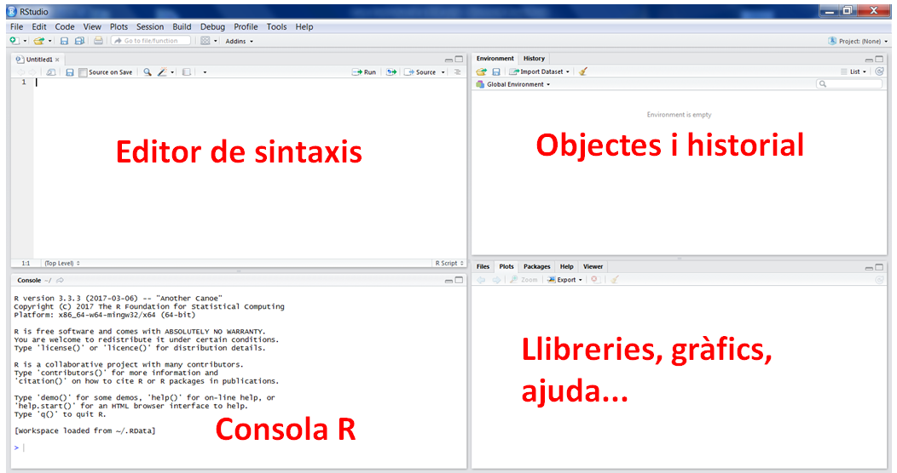
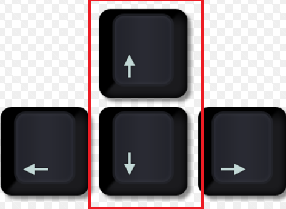
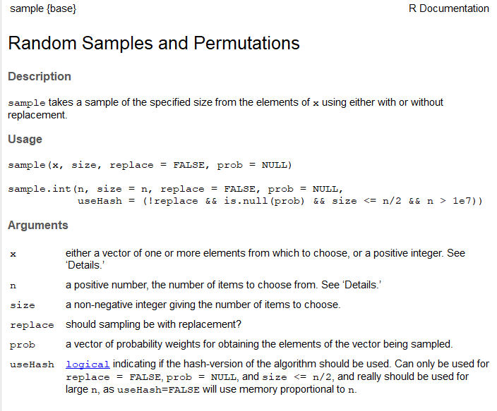

# Estructura del curs

## Sessió 1: Introducció a R

\bgroup
\hypersetup{linkcolor = red}
\listoffigures
\egroup

Part I: introducció

- Descarregar i instal·lar R
- Descarregar i instal·lar RStudio
- Què és R
- Què és i com s'utilitza RStudio
- Què és Markdown i Rmarkdown

Part II: iniciació a R

- Objectes de R: vectors, matrius, llistes i dataframes
- Instal·lació de paquets i llibreries.
- Operacions habituals de tractament de dades.
- Gràfics simples

## Sessió 2: iniciació a bases de dades

- Què és una base de dades: RDBMS.
- Introducció a SQL.
- Bases de dades: MySQL, SQL Sever, Postgres, MongoDB, Elasticsearch.
- Bases de dades en R.
- Importació/exportació de dades.
- APIs.

## Sessió 3: Manipulació de dades en R
- Vectorització
- Loops i funcions
- Família tidyverse
- Valors perduts (missings)

## Sessió 4: Estadística bàsica
- Test d'hipòtesi
- Models predictius

## Sessió 5
- Gràfics en R: ggplot i plotly.
- Informes: markdown avançat, beamer, Shiny.

#  Sessió 1

## Part I: introducció


## Bibliografia

### Introducció a R

> De Vries, Andrie, and Joris Meys. R for Dummies. John Wiley & Sons, 2015.

> Matloff, Norman. The art of R programming: A tour of statistical software design. No Starch Press, 2011.

### Introducció a bases de dades

> https://www.udemy.com/course/introduction-to-databases-and-sql-querying/

> https://datacarpentry.org/R-ecology-lesson/05-r-and-databases.html

> https://www.khanacademy.org/computing/computer-programming/sql/sql-basics/v/welcome-to-sql

## Biobliografia

### Manipulació de dades en R

> https://r4ds.had.co.nz/

> https://www.datacamp.com/courses/dplyr-data-manipulation-r-tutorial

> https://www.datasciencecentral.com/profiles/blogs/exclusive-tutorial-on-data-manipulation-with-r-50-examples

### Estadística bàsica en R

> Statistics, An introduction using R, de Michael J. Crawley i que podeu trobar a la biblio

> Field, Andy, et al. Discovering Statistics Using R. SAGE Publications, 2012.

## Biobliografia

### Models predictius

> Gareth James, Daniela Witten, Trevor Hastie, and Robert Tibshirani. 2013. An Introduction to Statistical Learning. Vol. 112. Springer, Berlin.

> https://www.r-bloggers.com/in-depth-introduction-to-machine-learning-in-15-hours-of-expert-videos/

> https://docs.healthcare.ai/

## Biobliografia

### Gràfics

> https://ggplot2-book.org/introduction.html

> Hadley Wickham (2010) A Layered Grammar of Graphics, Journal of Computational and Graphical Statistics, 19:1, 3-28, DOI: 10.1198/jcgs.2009.07098
> https://plotly.com/r/

### Rmarkdown

> https://rmarkdown.rstudio.com/lesson-1.html

### Shiny

> https://shiny.rstudio.com/tutorial/

## Cursos

> https://www.coursera.org/specializations/data-science-foundations-r

> https://www.edx.org/es/course/data-science-r-basics

> https://www.udemy.com/course/r-programming/

> https://github.com/ecorreig/analisi_dades_r

## Obtenir informació i ajuda

Llocs on treure informació sobre llibreries, tutorials o demanar ajuda:

**Tutorials**: https://www.statmethods.net/index.html, https://www.r-bloggers.com

**Documentació**: https://cran.r-project.org/manuals.html

**LLibreries** (exemple): https://cran.r-project.org/web/packages/lme4/lme4.pdf

**Demanar ajuda**: https://stackoverflow.com (prgramar)

**Demanar ajuda**: https://stats.stackexchange.com/ (estadística)

Per qualsevol altra cosa, google.

## Introducció

- R és un potent i flexible programari pensat per tractar dades, fer gràfics i anàlisis estadístics. 

- També és un llenguatge de programació amb funcions orientades a objectes.

- És programari lliure i funciona sota Windows, MAC OS i Linux.


## Baixar i instal·lar R

R és un llenguatge de programació, però s'instal·la a l'ordinador com qualsevol altre programa.
El podeu trobar a:

> https://cran.r-project.org/

On trobareu versions per linux, mac i windows. 

Baixeu-vos l'última versió disponible, que en el moment d'escriure aquest text és la 4.0.4.

Seguiu després les instruccions per instal·lar-lo al vostre ordinador. 

## RStudio

Una vegada instal·lat R ja el podem utilitzar, el que passa és que és difícil d'utilitzar com a tal, i per això fem servir un IDE (Entorn integrat de desenvolupament (en anlgès)), que bàsicament ens facilita la vida a l'hora de programar

L'IDE més utilitzat per R és RStudio, i és el que nosaltres utilitzarem. El podeu trobar a:

**mac**: https://medium.com/@GalarnykMichael/install-r-and-rstudio-on-mac-e911606ce4f4

**Windows**: https://medium.com/@GalarnykMichael/install-r-and-rstudio-on-windows-5f503f708027

**LINUX**: https://medium.com/@GalarnykMichael/install-r-and-rstudio-on-ubuntu-12-04-14-04-16-04-b6b3107f7779

Seguiu també les instruccions per instal·lar-lo.


## { width=7% } Studio

{ width=90% }


## Codificacions (encodings)
- A vegades, sobre tot en Windows, quan obrim un fitxer no es veuen bé els accents.

- Això és a causa de les codificacions, és a dir, com el sistema interpreta els números i lletres.

- En cas de que, en obrir un fitxer, no s'us vegin bé els accents, heu de fer el següent:

- Apreteu a File -> Reopen with encoding -> UTF-8.

- Si tot i així no es veu bé, feu: File -> Reopen with encoding -> Show all encodings -> LATIN1.


## Llibreries i funcions útils en R

En aquests links podeu trobar tant llibreries com funcions en R que us podem ajudar:

- Llibreries: https://support.rstudio.com/hc/en-us/articles/201057987-Quick-list-of-useful-R-packages

- Funcions http://www.sr.bham.ac.uk/~ajrs/R/r-function_list.html

 
# Part II: Introducció a R


## Consola

- Aquest símbol ">" és el prompt i és on haurem d'escriure les nostres ordres.

- Aquest símbol "#" serveix per introduir un comentari.

- Per separar expressions podem fer servir el ";" (no ho feu)

## Consola

- Si ens equivoquem podem pitgem la tecla "ESC" i tornarà a aparèixer el símbol ">"

- Podem navegar per les instruccions que ja hem executat fent servir les tecles  { width=10% }

- Per sortir del programa podem tancar o executar ">q()"

## Càlculs simples

```{r}
4+5

sqrt(49)

log(2)

rnorm(3)

```

##  Càlculs simples

```{r }
w <- 4+5 # deso el resultat de 4+5 a l'objecte w
w

sqrt(w)

x<-rnorm(3)
print(x)

```

## Espai de treball

- És l'espai on es desen de forma temporal o no tots els objectes que anem creant o carregant.
- Quan tanquem el programa el podem desar.

```{r , eval=FALSE}
getwd() #on és el meu espai de treball
ls() #quins objectes hi ha?

setwd("PATH") # hem de substituir el "path" pel de l'espai de 
# treball on volem estar
save.image("Prova.Rdata")
```

## Ajuda

Hi ha diferents maneres d'accedir a l'ajuda dins el programa:

```{r , eval=FALSE}
help.start()           # Inicialitzar l'ajuda

help.search("normal")  # Buscar "normal" a l'ajuda

help(package="base")   # Buscar info del paquet "base"

?log                # Buscar ajuda d'una funció concreta

```

## Com interpretar l'ajuda

Imaginem que volem saber més sóbre les funcions de distribució normals en R, escrivim:

```{r, eval = F}
?sample
```

- Ens surt una informació com aquesta: 

{ width=70% }

## Com interpretar l'ajuda

- Hi ha informació sobre diverses funcions, amb tots els paràmetres explicats. 
- Com veiem, les funcions a R sempre van amb el nom i parèntesis després on, si cal, hi poso els arguemnts (no s'ha de confondre amb les subseleccions, que van amb claudàtors).
- Important: els paràmetres que no tenen signe "=", per exemple x, q, p o n, són *obligatoris*
- Els que sí que tenen un signe "=", per exemple, mean o sd són opcionals i tenen valor per defecte el valor que trobem deprés de l'=. Per exemple el *valor per defecte* de la mitja és 0 i el de la desviació estàndard és 1. 

## Paquets i les llibreries

- R consta d'un sistema "base", que inclou molts mètodes estadístics, i un sistema per paquets que permeten anar molt més enllà.

- La comunitat R és qui elabora i manté aquests paquets (alguns signats per estadístics de gran renom).

## Paquets i les llibreries

Triem un repositori: 

```{r , eval=FALSE}
install.packages("ggplot2") # llibreria de gràfics que ja veurem
```

Un cop instal·lat l'haurem de carregar a la biblioteca:

```{r , eval=FALSE}
library(ggplot2) # require(ggplot2)
```

Això ho haurem de fer a cada sessió!

# Objectes

## Variables

- Les variables són els objectes més simple i poden ser:


1. numèric: números reals (3.1415)

2. complex: números complexes (2 + 5i)

3. character: cadenes alfanumèriques de text ("patata")

4. logical: variables lògiques (TRUE) 

## Objectes

- Recordem que R és un llenguatge de programació orientat a objectes.
- Els objectes estan formats per elements.

```{r}
w <- 3 + 4 # Creem l'objecte w
print(w)

# per cert: <- és equivalent a = !
```

- 7 és l'unic element de l'objecte w
- Els objectes més habituals són: variables, vectors, matrius, llistes i data frames.

## Tipus d'objectes

- Bàsicament podem identificar 4 tipus d'objectes:

1. Vectors
2. Matrius
3. Dataframes
4. Llistes

En aquest curs treballarem vectors i dataframes.

## Tipus d'objectes: vectors
\tiny

- És una col·lecció ordenada d'elements del **mateix tipus** (numèric, factor...)
- Es creen amb la funció c(), segurament la funció més important d'R!

```{r }
x <- c(2, 4, 6) # Vector de 3 elements numèrics parells
y <- c("A", "B", "C") # Vector de 3 elements cadena
z <- c(TRUE, FALSE, TRUE) # Vector de 3 elements lògics
```

## Algunes operacions: vectors
\tiny
```{r}
x<-1:10 # Genera un vector d'1 a 10
x[4] # La posició 4 és
 
x[x>7] # Elements més grans de 7

x+2 # Sumar un escalar
```

## Tipus d'objectes: dataframes

- És una col·lecció ordenada d'elements de **qualsevol tipus** amb dues dimensions.

\tiny
```{r}
id <- 1:10
sexe <- rep(c("M", "D"), 5)
normal <- rnorm(10)
curacio <- rep(c(FALSE, TRUE), 5)
dades <- data.frame(id, sexe, normal, curacio)
head(dades) # Mostrar primeres files/registres
```

## Algunes operacions: dataframes
\tiny
```{r}
str(dades) # Mostra estructura de les dades
dades$id # Mostra valors variable id
# Podem afegir una nova variable
edat <- c(67, 78, 89, 86, 56, 90, 68, 82, 92, 67)
dades.new <- data.frame(dades, edat)
```

## Algunes operacions: dataframes

```{r}
# O simplement afegir-ho a dades
dades$edat <- edat
summary(dades) # Resum sobre el dataset
```


# Subseleccions

## Introducció

- Els claudàtors "[ , ]" indiquen subselecció.
- La primera posició pertany a les files, la segona a les columnes.
- Poso un número o un vector dins de cada posició per indicar quines files o columnes vull.
- Si no poso res en una de les posicions estic indicant totes les files/columnes
- Si poso un número negatiu o un vector precedit d'un símbol "-" estic indicant totes les files/columnes menys aquella o aquelles.
- Atenció que els vectors s'han de fer o bé en format a:b o bé amb la funció c().


## Subseleccions I

```{r}
# Seleccionem una cel·la en concret, p. e., 
# fila 2 columna 1:
dades.new[2,1]
# Seleccionem una fila, per exemple la tercera:
dades.new[3,] # Noteu la coma i l'espai buit!
```

## Subseleccions II

```{r}
# Seleccionem una columna, per exemple la cinquena:
dades.new[,5]
# També ho podem fer amb el nom fent servir el símbol 
# del dòlar "$"
dades.new$edat
```

## Subseleccions III

- Podem seleccionar més d'una fila o columna
- El resultat és una altra dataframe

```{r}
# Per exemple, seleccionem les tres primeres files 
# i totes les columnes:
dades.new[1:3,]
```

## Subseleccions IV

```{r}
# Seleccionem les tres últimes columnes i totes les 
# files:
dades.new[,3:5] 
```

## Subseleccions V

```{r}
# Seleccionem totes les files menys la 4 i 
# totes les columnes menys la primera:
dades.new[-4,-1]
```

## Subseleccions VI

```{r}
# Podem crear una nova dataframe amb la subselecció:

dades.sub = dades.new[c(4,5,7:9),-c(1,3)]
dades.sub
```

## Subseleccions VII

```{r}
# Podem posar una condició dins de la subselecció

dones = dades.new[dades.new$sexe == "D",]
dones
```

## Subseleccions VIII

```{r}
# Un altre exemple:

grans = dades.new[dades.new$edat > 85,]
grans
```

# Exploració de les dades

## Estructura

Fem una ullada a les dades

```{r, eval=T}
str(dades) #mostra estructura d'un objecte
```

## Primeres files

```{r, eval=T}
head(dades) #mostra les primeres files
```

## Altres funcions

```{r, eval=FALSE}
tail(dades) #mostra les darreres files
```

```{r, eval=FALSE}
View(dades) #mostra tot el conjunt de dades 
```

# Manipulació de variables

##  Creació noves variables

Entrem les alçades i els pesos:

```{r}
dades$alcada = rnorm(nrow(dades), mean = 170, sd = 10)
dades$pes = rnorm(nrow(dades), mean = 75, sd = 10)
```

Índex de massa corporal $imc= \frac{pes}{alçada^{2}}$

```{r, eval=T}
alcada.m <- dades$alcada / 100
dades$imc <- dades$pes / alcada.m ^ 2
```

## Visualitzem

\small

```{r}
head(dades)
```

## Recodificació de variables

Re-codificar imc: <18;18-<25;25-<30;>30

```{r, eval=T}
dades$imccat <- cut(
  dades$imc,
  breaks = c(-Inf, 18, 25, 30, Inf),
  labels = c("baix pes", "normal",
             "sobrepes", "obesitat")
)
```

## Funcions de transformació de variables

- as.numeric()

- as.character()

- as.factor()

## Transformació de variables:exemples

- as.numeric

```{r, eval=T}
a <- c("1", "3", "5")
as.numeric(a)
```

Compte quan passem de caràcter a numèric!!!

```{r, eval=T}
b <- c("1", "est", "5")
as.numeric(b)
```


## Transformació de variables:exemples

Compte quan passem de factor a numèric!!!

```{r, eval=T}
b <- factor(c("1", "10", "5"))
as.numeric(b)
```

Passem sempre per as.character:
```{r}
as.numeric(as.character(b))
```

# Gràfics amb { width=10% }

## Introducció

- En R hi ha moltes llibreries per fer gràfics
- R base té capacitat per fer gràfics simples
- Per gràfics més avançats la llibreria més utilitzada és "ggplot2"
- N'hi ha d'altres, com ara "plotly".
- En aquest curs utilitzarem el paquet base, ggplot2 i plotly a l'última classe.

## Funció "plot"

```{r, eval = F}
plot(x = var.x, 
     y = var.y, 
     type = "tipus",
     col = "color",
     pch = "tipus de punt",
     cex = "mida del punt",
     lwd = "amplada de la línia",
     main = "títol",
     sub = "subtítol",
     xlab = "nom de l'eix x",
     ylab = "nom de l'eix y",
     ...)
```

## Funció "plot": diagrames de caixes

- Si passem variable categòrica fa boxplots:

```{r}
dades$sexe <- as.factor(dades$sexe)
plot(dades$sexe,dades$edat,main="D. caixes",xlab="sexe",ylab="edat")
```

## Funció "plot": diagrames de punts

- Si les dues variables són contínues fa un gràfic de punts:

```{r}
plot(dades$pes,dades$imc,pch=20,col="red",cex=2.5,
     main="D. punts",xlab="pes",ylab="imc")
```

## Histograma

```{r}
hist(dades$edat, main = "histograma", xlab = "imc")
```

# Final de la sessió 1.


