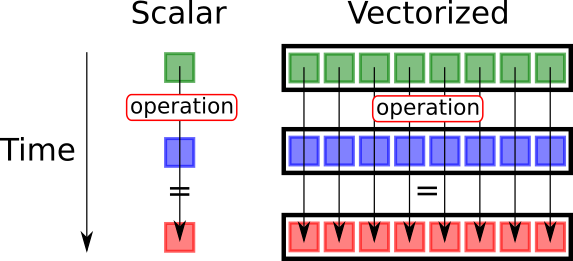
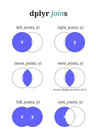

```{r setup, include=FALSE}
knitr::opts_chunk$set(echo = T, message = F, warning = F)
```

```{r, echo=F}
library(dplyr)
```

# Introducció

## Vectorització

R és molt lent.

Cada vegada que fas un loop Déu mata un gatet. 


S'ha de vectoritzar.

## Vectorització



R està pensat per vectoritzar sempre que es pugui.

## Exemple {.smaller}

```{r}
vec <- rnorm(5, 50, 10)
```

Vull multiplicar per 2:

Loop:

```{r}
for (a in vec) {
 print(a * 2)
}
```

Vectoritzat:

```{r}
vec * 2
```

## Exemple 2

Tinc un dataframe:

```{r}
df <- data.frame(a = rbinom(10, 5, .2), b = rbinom(10, 5, .7))
head(df)
```

## Exemple 2

Vull fer c que sigui la suma dels dos:

Loop:

```{r}
df$c <- NULL
for (i in 1:nrow(df)) {
 df$c[i] <- df$a[i] + df$b[i]
}
```

Vectoritzat:

```{r}
df$c <- df$a + df$b
```

## Condicionals

```{r}
a <- 2
if (a > 1) {
 print("a és més gran que 1")
} else if (a == 1) {
 print("a és 1")
} else {
 print("a és més petit que 1")
}
```

## Operadors lògics

| Símbol | Descripció
|--------|:-------------:| 
|== |	Igual	|
|> | Més gran que		|
|<	| Més petit que	|
|>=	| 	Més gran o igual	|
|<=		| Més petit o igual		|
| !=	| No igual		|
|%in% | Un element es troba dins d'un vector d'elements?	|

## Exemple: dataframe

Loop: 

```{r}
df$d <- NULL
for (i in 1:nrow(df)) {
 if (df$c[i] > 5) {
   df$d[i] <- "Malalt"
 } else {
   df$d[i] <- "No malalt"
 }
}
```

Vectoritzat:

```{r}
df$d <- ifelse(df$c > 5, "Malalt", "No malalt")
```


# Tidyverse

## Introducció

Conjunt de paquets d'R per fer "data science".

[https://www.tidyverse.org/](https://www.tidyverse.org/)

Unifica l'anàlisi de dades en R.

## Paquets dins de tidyverse

Llistat aquí: 

[https://www.tidyverse.org/packages/](https://www.tidyverse.org/packages/)

## Importació

| Paquet | Propòsit | Funcions |
|--------|-------------| ------ |
| readr | Importar csv, txt, etc. | read_delim |
| readxl | Importar xls, xlsx	| read_excel|
| haven | Importar spss, stata, sas	| read_spss, read_stata, read_sas|
| jsonlinte | Importar json	| fromJSON, toJSON |
| xml2 | Importar XML	| read_xml, read_html |
| DBI | Bases de dades	| base per altres paquets |

## Manipulació

| Paquet | Propòsit | Funcions
|---|--------| --------- |
| tibble | Dataframes millorats	| as_tibble, tibble, rownames_to_column |
| dplyr | Manipulació de dades	| mutate, select, filter, group_by, summarise, xx_join |
| tidyr | Manipulació "avançada" | pivot_longer, pivot_wider, unnest_longer, unnest_wider | 
|  | 	| nest, unnest, separate, extract, unite, complete, drop_na, replace_na, fill | 
| stringr | Caràcters | str_subset, str_replace, str_detect... |
| forcats | Factors | fct_reorder, fct_infreq, fct_relevel |
| lubridate | Dates | ymd_hms, month, bday, today, floor_date | 

## Altres

| Paquet | Propòsit | Funcions
|--------|-------------| ------- |
| ggplot2 | Gràfics | ggplot, geom_xx |
| purrr | Funcions vectoritzades | split, map, map2 |
| magrittr | pipes | %>%, %$%, %<>% |
| glue | Enganxar caràcters | glue | 

# Exploració de les dades

## Estructura

Fem una ullada a les dades

```{r, eval=T}
dades <- readr::read_csv("input/dades.csv", locale = readr::locale(encoding = "latin1"))
str(dades) #mostra estructura d'un objecte
```

## Primeres i últimes files

```{r, eval=F}
head(dades) #mostra les primeres files
```

```{r, eval=T}
tail(dades) #mostra les darreres files
```

## Visualització tipus "excel"

```{r, eval=FALSE}
View(dades) # mostra tot el conjunt de dades 
```

## Resum

```{r}
summary(dades)
```

# Manipulació de variables

##  Creació noves variables: mutate

Entrem les alçades i els pesos:

```{r}
dades <- dades %>%
  mutate(
    alcada = rnorm(nrow(.), mean = 170, sd = 10),
    pes = rnorm(nrow(.), mean = 75, sd = 10)
  )
dades
```

##  Creació noves variables: mutate 

Índex de massa corporal $imc= \frac{pes}{alçada^{2}}$

```{r, eval=T}
dades <- dades %>% 
 mutate(imc = pes / (alcada / 100) ^ 2)
dades
```

## Recodificació de variables: case_when {.smaller}

re-codificar imc: <18;18-<25;25-<30;>30
```{r, eval=T}
dades <- dades %>%
  mutate(
    cat_oms = case_when(
      imc < 18 ~ "baix pes",
      imc < 25 ~ "normopès",
      imc < 30 ~ "sobrepès",
      T ~ "obesitat"
    ),
    cat_oms = as.factor(cat_oms)
  )
dades
```


## Funcions de transformació de variables

- as.numeric(): números

- as.character(): cadenes alfanumèriques

- as.factor(): factors

## Seleccionar variables: select {.smaller}

```{r}
dades %>%
 select(c(sexe, curació, edat, imc, cat_oms))
```

```{r}
dades %>%
 select(-c(id, normal, imc))
```

## Condicions: where {.smaller}

```{r}
dades %>% 
 select(where(is.numeric))
```

## Seleccionar amb ends_with, starts_with {.smaller}

```{r, include=F, eval=F, echo=F}
url <- "https://analisi.transparenciacatalunya.cat/resource/tasf-thgu.json"
q <- "?$where= data >= '2019-01-01' and data <= '2020-03-13'"
l <- paste0(url, q)
data <- RSocrata::read.socrata(l, stringsAsFactors = F)
aa <- data %>% 
        filter(municipi %in% c("Reus", "Tarragona")) %>% 
        select(-c(geocoded_column.type, geocoded_column.coordinates))
write.csv(aa, "input/contaminacio.csv", row.names = F)
```

Dades de contaminació

```{r}
library(readr)
cont <- read_csv("input/contaminacio.csv", locale = locale(encoding="latin1"))
orig <- cont
head(cont)
```

## Seleccionar amb ends_with, starts_with {.smaller}

```{r}
cont <- cont %>%
  select(data, municipi, contaminant, unitats, starts_with("h"))
cont
```

## Filtrar: filter {.smaller}

```{r}
cont %>%
 filter(municipi == "Reus", contaminant == "CO", data > "2019-12-29")
```

## Filtrar: distinct {.smaller}

```{r}
nrow(cont)
```

```{r}
cont <- cont %>%
 distinct()
nrow(cont)
```

## Pivotar: pivot_longer {.smaller}

```{r}
library(tidyr)
cont <- cont %>%
 pivot_longer(starts_with("h"))
cont
```

## Netejar: drop_na

```{r}
cont <- cont %>% 
        drop_na() 
cont
```

## Pivotar: pivot_wider {.smaller}

```{r}
wcont <- cont %>% 
  distinct(data, municipi, contaminant, name, .keep_all = T) %>%
  pivot_wider(names_from = contaminant, values_from = value)
wcont
```

## Agrupar i resumir: group_by i summarize {.smaller}

```{r}
wcont %>%
  drop_na(CO) %>%
  group_by(municipi) %>%
  summarise(across(CO, mean))
```

## Agrupar i resumir: group_by i summarize {.smaller}

Sobre múltiples columnes a la vegada

```{r}
wcont %>%
  drop_na(c(H2S, NO, NO2)) %>%
  group_by(municipi) %>%
  summarise(across(c(H2S, NO, NO2), mean))
```

## Agrupar i resumir: group_by i summarize {.smaller}

```{r}
wcont %>%
  drop_na(CO) %>%
  group_by(data, municipi) %>%
  summarise(across(CO, max))
```

## Canviar els noms: rename

```{r}
wcont %>%
  rename(c("Ciutat" = "municipi", "Hora" = "name", "Data" = "data"))
```

## Canviar els noms: rename_with

```{r}
library(stringr)
tt <- orig %>%
  rename_with(~ gsub("h", "Hora - ", .x, fixed = T), starts_with("h"))
names(tt)
```

## Treballar amb caràcters

```{r}
nom <- "Eudald"
```

Abans:

```{r}
print(paste("Hola, em dic ", nom, ".", sep = ""))
```

Ara:

```{r}
library(glue)
print(glue("Hola, em dic {nom}."))
```

## Treballar amb caràcters

```{r}
cont %>%
  mutate(
    contaminant = glue("{contaminant} ({unitats})")
  )
```

## Dates: lubridate {.smaller}

Tinc una cadena alfanumèrica que vull convertir a data:

```{r}
dt <- "16/03/2021 12:23"
```

Abans:

```{r}
as.POSIXlt(dt, format = "%d/%m/%Y %H:%M")
```

Ara:

```{r}
library(lubridate)
dmy_hm(dt)
```

## Dates: floor_date

```{r}
wcont <- wcont %>%
  mutate(Setmana = floor_date(data, "week"))
wcont
```

## Dates: floor_date

```{r}
wcont %>%
  mutate(
    Setmana = glue("Setmana {week(Setmana)}")
  ) %>%
  select(c(data, municipi, Setmana))
```

## Ajuntar dataframes: inner_join

Què passa si volem ajuntar dos datasets?

Agafem dades de població per municipi (que podeu trobar al fitxer municipis.xlsx)

```{r}
muns <- readxl::read_excel("input/municipis.xlsx")
muns
```

```{r}
wcont <- wcont %>%
        inner_join(muns, by = c("municipi" = "Municipi"))
```

## Tipus de joins



## Show off {.smaller}

```{r}
wcont %>%  drop_na(CO) %>%
  group_by(floor_date(data, "week"), municipi) %>%
  summarise(across(CO, mean)) %>%
  rename_with(~ c("Setmana", "Ciutat", "CO")) %>%
  group_by(Ciutat) %>%
  plotly::plot_ly(x = ~ Setmana, y = ~ CO, color = ~ Ciutat, 
                  type = 'scatter', mode = 'lines')
```

## Fi

\center
\Large

Final de la sessió 3.

