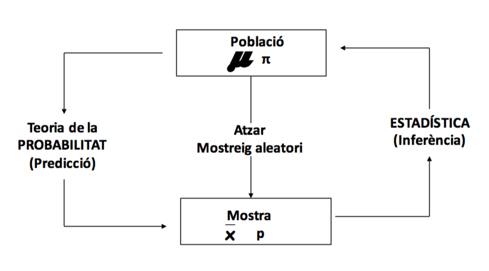
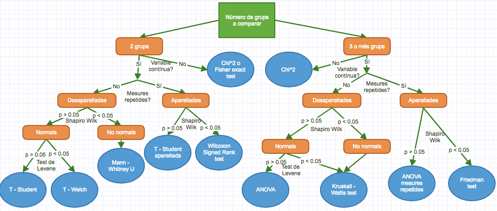

```{r setup, include=FALSE}
knitr::opts_chunk$set(echo = T, message = F, warning = F)
library(dplyr)
```

```{r, echo=F}
set.seed(2901)
df <- readr::read_csv("input/indian_liver_patient.csv") %>%
  rename(Malaltia = Dataset) %>%
  mutate(
    Malaltia = ifelse(Malaltia == 1, "No malalt", "Malalt"),
    across(where(is.character), as.factor)
    ) 

```

# Què és l'estadística?

## 



## Parts

### Estadística descriptiva

### Tests d'hipòtesi

### Models predictius

# Estadística descriptiva

## Descriure les variables de l'estudi.

Aquestes poden ser:
- Categòriques
- Numèriques

Les podem donar:
- Soles (la mitjana d'edat de la mostra és de 70 anys).
- Creuades (la mitjana d'edat de tractats és de 45 i la de no tractats de 60).

## Variables categòriques

Tipus | Dades | Gràfics
----- | --------------- |--------------- |
Soles | Percentatges | De barres|
Creuades | Percentatges | De barres aparellats|
Creuades |  Taules de contingència  | De mosaic|

## Exemples dades

```{r, echo=T}
prop.table(table(df$Gender)) * 100
```

```{r, echo=T}
prop.table(table(df$Gender, df$Malaltia)) * 100
```

## Funcions útils {.smaller}

```{r}
gmodels::CrossTable(df$Gender, df$Malaltia, chisq = T, fisher = T)
```

## Exemples gràfics - Variable sola

```{r}
plot(df$Gender)
```

## Exemples gràfics - Variables creuades

```{r}
plot(df$Gender, df$Malaltia)
```

## Exemples gràfics

```{r}
library(ggplot2)
ggplot(df, aes(x = Gender, fill = Malaltia)) + 
  geom_bar(stat = "count", position = "dodge")
```

## Exemples gràfics

```{r}
library(ggplot2)
ggplot(df, aes(x = Gender, fill = Malaltia)) + 
  geom_bar(stat = "count", position = "stack")
```

## Variables contínues

Tipus | Dades | Gràfics
----- | --------------- |--------------- |
Soles - Normals | Mitjana i desviació estàndard | Histograma o boxplot |
Soles - No normals | Mediana i quartils | Histograma o boxplot |
Creuada amb una categòrica |  Mitjanes / Medianes dels grups | Boxplots o Violinplots   |
Creuada amb una contínua | Correlació | Gràfic de punts   |

## Exemples dades

```{r, echo=T}
shapiro.test(df$Total_Bilirubin)
```

No és normal, per tant:

```{r}
summary(df$Total_Bilirubin)
```

## Exemples dades

```{r, echo=T}
psych::describeBy(df$Total_Bilirubin, df$Gender)
```

## Exemples gràfics - Variables soles

```{r}
hist(df$Total_Bilirubin)
```

## Exemples gràfics - Variables creuades amb categòrica

Veieu que plot ja tria automàticament el tipus de gràfic!

```{r}
plot(df$Gender, df$Total_Bilirubin)
```

## Exemples gràfics - Variables creuades

```{r}
library(ggplot2)
ggplot(df, aes(x = Gender, y = Alkaline_Phosphotase, fill = Malaltia)) + 
  geom_violin()
```

## Exemples gràfics - Variables creuades amb contínua

```{r}
library(ggplot2)
ggplot(df, aes(x = Total_Protiens, y = Albumin, colour = Malaltia)) + 
  geom_point() + 
  geom_smooth(method = "lm")
```

## Tot a la vegada: taula descriptiva {.smaller}

Paquet CompareGroups

```{r, echo=T}
library(compareGroups)
res <- compareGroups(Malaltia ~ ., data = df, method = 4)
restab <- createTable(res)
export2md(restab, format = "html")
```

## Tot a la vegada: gràfics {.smaller}

```{r, eval=F}
GGally::ggpairs(df)
```

## Interludi: transformació de variables

En aquests casos en què les variables tenen distribucions molt escorades cap a l'esquerra (cosa que passa molt sovint) és recomanable fer-ne el logaritme:

```{r, eval=F}
df %>% 
  mutate(
    Total_Protiens = log(Total_Protiens),
    Albumin = log(Albumin),
    # etc.
  )
```

**NOTA:** compte perquè el logaritme de 0 és -Inf! Assegureu-vos que no tenim valors iguals o més petits que 0 abans de fer el logaritme.

## Transforamació de variables: gràficament

```{r, echo=F}
df1 = as.data.frame(cbind(df$Alkaline_Phosphotase, 
                          df$Alamine_Aminotransferase))
df2 = as.data.frame(cbind(log10(df$Alkaline_Phosphotase), 
                          log10(df$Alamine_Aminotransferase)))
p1 = ggplot(df1, aes(x=V1, y=V2)) + 
  geom_point() + 
  geom_smooth(method="lm", se=FALSE) +
  ggtitle("Sense logaritme")  + 
  xlab("Alkaline Phosphotase") + 
  ylab("Alamine Aminotransferase") +
  theme_bw() +
  theme(legend.position="none")
  

p2 = ggplot(df2, aes(x=V1, y=V2)) + 
  geom_point() + 
  geom_smooth(method="lm", se=FALSE) +
  ggtitle("Amb logaritme")  + 
  xlab("Log Alkaline Phosphotase") + 
  ylab("Log Alamine Aminotransferase") +
  theme_bw() +
  theme(legend.position="none")
  
gridExtra::grid.arrange(p1, p2, ncol=2)
```

# Tests d'hipòtesi

## Hipòtesis

### **Hipòtesi de treball** o hipòtesi alternativa ($H_1$)

És la hipòtesi de l'estudi, la que volem "demostrar". 

Exemple: hi ha més contaminació a Tarragona que a Reus.

### **Hipòtesi nul·la** ($H_0$)

És la contrària a la d'estudi. Ens permet descartar o no la d'estudi.

Exemple: Reus està igual o més de contaminat que Tarragona.

## Variables

**Variable independent:** la variable de base, la que no depèn de l'altra.

Exemple: municipi (Reus o Tarragona).

**Variable dependent:** la variable d'interès, que volem saber si depèn (o està associada) amb la independent.

Exemple: nivell de contaminació.

## Exemple: gràficament {.smaller}

```{r}
library(tidyr)
loc <- readr::locale(encoding = "latin1")
cont <- readr::read_csv("input/contaminacio.csv", locale = loc) %>%
  pivot_longer(starts_with("h")) %>%
  select(data, contaminant, municipi, name, value) %>%
  mutate(municipi = as.factor(municipi)) %>%
  drop_na()
plot(log(value) ~ municipi, cont %>% filter(contaminant == "H2S"))
```

Sembla que a Tarragona hi ha més H2S. Però és significatiu o és l'atzar?

## Nivell de confiança i p-valor

> Quines probabilitats hi ha de trobar les nostres dades donat que la hipòtesi nul·la ($H_0$) és certa?

És a dir, quines probabilitats hi ha de que el que hagi vist sigui a causa de l'atzar?

Aquesta probabilitat mai és 0, així que he d'establir un nivell de confiança (normalment el 95%). Això vol dir que si calculo que les probabilitats de que la hipòtesi nul·la sigui certa donades les meves dades són de menys del 5%, la *rebutjaré* i *acceptaré* l'alternativa.

Aquesta probabilitat és el **p-valor**.

## Tests d'hipòtesi {.smaller}

```{r, out.width = "800px", echo=F}

```

## En R {.smaller}

Test | Comanda 1 | Comanda 2
------------------ | ---------------------- | ---------------------
Chi 2 | chisq.test(x, y) | 
Fisher exact test | fisher.test(x, y) | 
Shapiro Wilk | shapiro.test(x) |
Levene | var.test(x, y) | levene.test(y, group) 
T - Student | t.test(x, y, var.equal = TRUE) | t.test(formula, data, var.equal = TRUE)
T - Welch | t.test(x, y) | t.test(formula, data)
Mann-Whitney U | wilcox.test(x, y) | wilcox.test(formula, data)

## En R (continuació) {.smaller}

Test | Comanda 1 | Comanda 2
------------------ | ---------------------- | ---------------------
T - Welch aparellada | t.test(x, y, paired = TRUE) | t.test(formula, data, paired = TRUE)
Wilcoxon Signed Rank | wilcox.test(x, y, paired = TRUE) | wilcox.test(formula, data, paired = TRUE)
ANOVA | aov(formula, data) |
Kruskall Wallis | kruskal.test(x, g) | kruskal.test(formula, data)
ANOVA mesures repetides | ez::ezANOVA(data, dv, wid) |
Friedman | friedman.test(y, groups) | friedman.test(formula, data)

## Exemple: contaminació {.smaller}

Tenim una variable independent categòrica amb dos factors (municipi amb Reus i Tarragona) i una variable dependent contínua.

Primer mirem si la variable és normal amb el test de shapiro.wilk:

```{r, error=T}
shapiro.test(cont$value)
```

Vaja... Agafem doncs només les 5000 primeres entrades:

```{r}
shapiro.test(cont$value[1:5000])
```

Com que el p-valor és més petit de 0.05 i la hipòtesi nul·la del test de shapiro és que la variable és normaml, diem que **no** és normal.

## Exemple: contaminació

Per tant, fem test U de Mann Whitney, en R:

```{r}
wilcox.test(value ~ municipi, cont)
```

El p-valor és 0, per tant la diferència és moooolt significativa. Tarragona està estadísticament més contaminat d'H2S que Reus.

## Exemple: variables categòriques {.smaller}

Tornem a les variables antigues: qui té més malaltia, homes o dones?

```{r}
ggplot(df, aes(x = Gender, fill = Malaltia)) + 
  geom_bar(stat = "count", position = "dodge")
```


## {.smaller}

```{r, echo=F}
gmodels::CrossTable(df$Gender, df$Malaltia)
```

## Test d'hipòtesi

La variable independent és categòrica amb dos factors: home o dona.

La variable dependent és categòrica amb dos factors: malalt o no malalt.

> Test de chi quadrat

```{r}
chisq.test(df$Gender, df$Malaltia)
```

Amb un 95% de confiança, **no** hi ha diferències significatives!

## Exemple: a més edat, més bilirrubina?

Ja sabem que la bilirrubina no segueix una distribució normal, així que hem de fer un test de correlació d'Spearman:

```{r}
cor.test(df$Age, df$Total_Bilirubin, method = "spearman")
```

Sí que hi ha correlació significativa. Però...

## Gràficament

```{r}
ggplot(df, aes(x = Age, y = log(Total_Bilirubin))) + 
  geom_point() + 
  geom_smooth(method = "lm")
```

No! Això és un desastre!

## Exemple: hi ha més casos de covid (en proporció) en poblacions més grans?

Mirem els últims 30 dies per simplicitat

Agafem dades covid:

```{r}
library(RSocrata)
start <- lubridate::today() - 30
p <- "https://analisi.transparenciacatalunya.cat/resource/jj6z-iyrp.json"
q <- glue::glue("?$where= data > '{start}'")
covid <- read.socrata(glue::glue(p, q))
```

Agafem dades població

```{r}
muns <- readxl::read_excel("input/municipis.xlsx")
```

## Netegem i ajuntem

```{r}
covid <- covid %>%
  select(-c(ends_with("codi"), districtedescripcio)) %>%
  mutate(
    numcasos = as.numeric(numcasos),
    across(where(is.character), as.factor)
  ) 
```

```{r}
muns <- muns %>%
  mutate(
    Municipi = toupper(
      stringi::stri_trans_general(Municipi, "Latin-ASCII")
      )
  )
```

```{r}
tot <- covid %>% 
  inner_join(muns, by = c("municipidescripcio" = "Municipi"))
```

## Càlculs

Calculem els casos per habitant (per cada dia) i en fem la mitjana ( també prenem el logaritme de la Població.)

```{r}
tot <- tot %>%
  mutate(
    ratio_casos = numcasos / Població,
    densitat = Població / Superfície
    ) %>%
  drop_na() %>%
  group_by(municipidescripcio, densitat, Població) %>%
  summarise(sum = sum(ratio_casos))
```

## Gràfics

```{r}
ggplot(tot, aes(x = log(densitat), y = log(sum), size = Població)) + 
  geom_point() +
  geom_smooth(method = "lm") + 
  theme(legend.position = "none")
```

## Test de correlació

```{r}
cor.test(~ log(sum) + log(densitat), tot)
```

No hi ha associació (correlació).

# Models predictius

## Regressions

Amb els models predictius, no només comprovem una hipòtesi d'associació, si no que podem predir amb dades futures. Poden ser de molts tipus: nosaltres només veurem regressions lineals i logístiques.

### Regressions lineals

#### Univariants

\[ y = \beta_0 + \beta_1 * x  \]

#### Multivariants

\[ y = \beta_0 + \beta_1 * x_1 + \beta_2 * x_2 + \beta_3 * x_3 + ... + \beta_n * x_n \]

On $x$ són és variables independents (o predictores) i $y$ la variable dependent (o predita).

## Regressions

Hem de trobar les $\beta_1, ... \beta_n$ que ajustin el millor possibles els valors de les $x$ amb la $y$: **Ajust per mínims quadrats.**

```{r, echo=F}
liver = read.csv('input/indian_liver_patient.csv') #importo les dades
sample = sample(1:nrow(liver),50) # no vull totes les dades perquè el dibuix no queda bé, n'agafo algunes

liver$Albumin = liver$Albumin+runif(nrow(liver),min=-0.1, max=0.1) # aquí faig una mica de trampes perquè el dibuix quedi millor

mod = lm(Total_Protiens~Albumin, data = liver[sample, ]) 
preds = predict(mod)# construeixo un model lineal i predic els valors de y per poder dibuixar les ratlles verticals

ggplot(liver[sample, ], aes(x=Albumin, y=Total_Protiens, colour="orange")) + 
  geom_point() + 
  geom_smooth(method="lm", colour = "blue", se=FALSE) +
  geom_segment(data=liver[sample, ], 
               aes( x = Albumin, xend = Albumin, y=preds,  yend = Total_Protiens),
               colour = "black") +
  theme_bw() +
  theme(legend.position="none", 
        axis.title.x=element_blank(),
        axis.text.x=element_blank(),
        axis.ticks.x=element_blank(),
        axis.title.y=element_blank(),
        axis.text.y=element_blank(),
        axis.ticks.y=element_blank())
```

## Regressió lineal en R - Univariant {.smaller}

```{r, echo = TRUE}
model = lm(Total_Protiens ~ Albumin, data = df)
summary(model)
```

## Regressió lineal en R - Multivariant {.smaller}

```{r, echo=F}
df <- df %>%
  select(-Direct_Bilirubin, -Aspartate_Aminotransferase) %>%
  mutate(
    Total_Bilirubin = log(Total_Bilirubin),
    Alkaline_Phosphotase = log(Alkaline_Phosphotase),
    Alamine_Aminotransferase = log(Alamine_Aminotransferase)
  ) %>%
  drop_na()
```

```{r}
model2 = lm(Total_Protiens ~ . - Malaltia, data = df); summary(model2)
```

## Regressió logística

La fem servir quan la variable dependent és dicotòmica:

\[\phantom{aa} Y = \frac{1}{1+e^{-(\beta_o+\beta_1X+\epsilon)}}\]

```{r, echo=F}
liver <- liver %>%
  mutate(
    Malaltia = Dataset - 1,
    Total_Bilirubin = ifelse(Malaltia == 1, log(Total_Bilirubin) + 3, log(Total_Bilirubin))
  )
ggplot(liver, aes(x = Total_Bilirubin, y = Malaltia)) +
  geom_point(colour="orange") + 
  theme_bw() +
  geom_smooth(method = "glm", method.args = list(family = "binomial"))+
  scale_y_discrete(limits=c(0, 1), 
                   labels = c("0" = "Sa", "1" = "Malalt")) 

```

## Regressió logística en R {.smaller}

```{r, echo=TRUE}
model4 = glm(Malaltia ~ Age + Gender + Total_Bilirubin, data=df, family="binomial"); summary(model4)
```

## Gràficament

```{r}
ggplot(df, aes(x = Age, y = Total_Bilirubin, colour = Malaltia)) + 
  geom_point()
```

## Resum


Independent  \\  Dependent | Categòrica | Contínua
----- | ---------- |--------------- |
Categòrica | $\chi^2$; Test de Fisher  | Test T; U de Mann Whitney; ANOVA|
Contínua | Regressió logística | Correlació; regressió lineal|

# Fi
