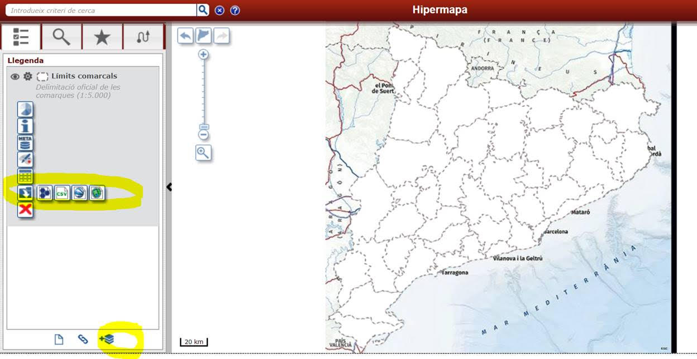

```{r setup, include=FALSE}
knitr::opts_chunk$set(echo = TRUE, message = F, warning = F)
library(dplyr)
```

# Mapes bàsics

La llibreria més utilitzada per fer mapes en R (i en qualsevol cosa) és [leaflet](https://rstudio.github.io/leaflet/).

Veiem un exemple:

```{r}
library(leaflet)
leaflet() %>%
  # Afegim el mapa de base (si no posem res surt el per defecte)
  addTiles() %>%  
  addMarkers(lng=1.10499, lat=41.15553, popup="La millor facultat de la URV")
```

Molt bé però aquest mapa és una mica lleig. [Aquí](https://leaflet-extras.github.io/leaflet-providers/preview/) tenim tots els possibles. 

L'afegim de la següent manera:

```{r}
leaflet() %>%
  addProviderTiles(providers$CartoDB.VoyagerLabelsUnder) %>%
  addMarkers(lng=1.10499, lat=41.15553, popup="La millor facultat de la URV")
```

Molt bé! Ara potser no volem tant de zoom al principi, ho fem amb la funció setView:

```{r}
leaflet() %>%
  addProviderTiles(providers$CartoDB.VoyagerLabelsUnder) %>%
  addMarkers(lng=1.10499, lat=41.15553, popup="La millor facultat de la URV") %>%
  setView(lng=1.10499, lat=41.15553, zoom = 9)
```

Vinga, va, poso les altres facultats també:

```{r}
facs <- readr::read_csv("input/data.csv", locale = readr::locale(encoding = "latin1")) %>%
  mutate(lat = as.numeric(lat))
```

```{r}
facs %>%
  leaflet() %>%
  addProviderTiles(providers$CartoDB.VoyagerLabelsUnder) %>%
  addMarkers(lng= ~ lng, lat= ~ lat, popup= ~ Campus) %>%
  setView(lng=1.10499, lat=41.15553, zoom = 9)
```

Potser volem uns marcadors més monos. Podem posar els que vulguem des d'un png per exemple:

```{r}
urv_icon <- makeIcon(
  iconUrl = "input/urv-centrat-color.png",
  iconWidth = 60, iconHeight = 40,
  iconAnchorX = 30, iconAnchorY = 40,
  # shadowUrl = "http://leafletjs.com/examples/custom-icons/leaf-shadow.png",
  # shadowWidth = 50, shadowHeight = 64,
  # shadowAnchorX = 4, shadowAnchorY = 62
)
```

```{r}
facs %>%
  leaflet() %>%
  addProviderTiles(providers$CartoDB.VoyagerLabelsUnder) %>%
  addMarkers(lng= ~ lng, lat= ~ lat, popup= ~ Campus, icon=urv_icon) %>%
  setView(lng=1.10499, lat=41.15553, zoom = 9)
```

# Mapes amb contorns

Per dibuixar contorns necessitarem un fitxer amb les delimitacions. Normalment s'utilitzen shapefiles (.shp). Per exemple, els dels municipis de Catalunya es pot trobar [aquí](https://www.icgc.cat/Administracio-i-empresa/Descarregues/Capes-de-geoinformacio/Base-municipal).

Teniu un repo de shapefiles molt pontent [aquí](https://sig.gencat.cat/visors/hipermapa.html). Heu d'apretar al símbol de sota, carregar la informació que vulgueu i descarregar-la en les icones de l'esquerra de la següent imatge:



Compte perquè els fitxers shp no van sols, van acompanyats d'una sèrie d'altres fitxers que contenen metadates, etc. Assegureu-vos de tenir-los tots a la mateixa carpeta.

Imaginem que volem el mapa de Municipis (que he posat a la carpeta "mapes"). Per carregar-lo, necessitem la funció st_read de la llibreria "sf":

```{r}
library(sf)
mapa <- st_read("mapes/bm5mv21sh0tpm1_20200601_0.shp")
```

```{r}
glimpse(mapa)
```

Fixeu-vos que tinc diverses columnes, entre elles l'última que és de tipus multipolygon. Això són les corbes del mapa.

Heu de fer servir una sèrie de comandes perquè això es vegi bé (segurament necessitareu molt d'stackoverflow per aquest tipus de coses perquè no estan gaire estandaritzades). En qualsevol cas, heu de fer:

```{r}
mapa <- rmapshaper::ms_simplify(st_transform(mapa, "+proj=longlat +datum=WGS84"))
```


Ho dibuixo amb la funció addPolygons:

```{r}
facs %>%
  leaflet() %>%
  addProviderTiles(providers$CartoDB.VoyagerLabelsUnder) %>%
        addPolygons(
          data = mapa,
          weight = 1,
          smoothFactor = 0.2,
          fillOpacity = .7,
          label = mapa$NOMMUNI
        ) %>%
  addMarkers(lng= ~ lng, lat= ~ lat, popup= ~ Campus, icon=urv_icon) %>%
  setView(lng=1.50499, lat=41.5, zoom = 7)
```

Ja tenim les divisions municipals. Ara, com no pot ser d'altra manera, hi pintarem l'incidència acumulada de covid ajuntant tot el que hem fet fins ara:

```{r}
library(RSocrata)
start <- lubridate::today() - 14
p <- "https://analisi.transparenciacatalunya.cat/resource/jj6z-iyrp.json"
# Fixeu-vos amb les cometes simples de l'start! Això és perquè lo que passarà aquí 
# dins en el fons és un string i el Socrata ho ha de saber
q <- glue::glue("?$where= data > '{start}'")
covid <- RSocrata::read.socrata(glue::glue(p, q), stringsAsFactors = F) %>%
  mutate(
    # Converteix el número de casos a numèric
    numcasos = as.numeric(numcasos),
    # I tota la resta (que encara son caràcters) a factor
    across(where(is.character), as.factor)
  )
# Arreglo codis
muns <- readxl::read_excel("input/municipis.xlsx") %>%
      mutate(Codi = substr(Codi, 1, 5))

muns_covid <- muns %>%
  inner_join(covid, by = c("Codi" = "municipicodi"))

# Arreglo més codis:
mapa <- mapa %>% mutate(CODIMUNI = substr(CODIMUNI, 1, 5))
```

Ara he d'ajuntar el mapa amb les dades de covid. Per sort, els codis de municipi de l'excel que tinc jo i els del mapa són els mateixos, així que puc ajuntar per alla (aquí passa una cosa que en ajuntar un tibble amb un mapa, el mapa se n'oblida que és mapa i li he de tornar a dir amb la funció st_as_sf:

```{r}
tot <- st_as_sf(muns_covid %>% inner_join(mapa, by = c("Codi" = "CODIMUNI")))
```

Calculo la IA i faig gràfic:

```{r, out.width="100%"}
# Primer creem la paleta 
tot_mapa <- tot %>%
  group_by(NOMMUNI, Població) %>%
  summarise(casos = sum(numcasos)) %>%
  mutate(IA = casos / Població * 100000)

pal <- colorNumeric(
  palette = "YlOrRd",
  domain = tot_mapa$IA
  )
tot_mapa %>%
  leaflet() %>%
  addProviderTiles(providers$CartoDB.VoyagerLabelsUnder) %>%
  addPolygons(
    data = tot,
    weight = 1,
    smoothFactor = 0.2,
    fillOpacity = .7,
    color = ~ pal(tot_mapa$IA),
    label = ~ NOMMUNI,
    popup = ~ glue::glue("La IA és {round(tot_mapa$IA, 1)}")
  ) %>%
  addMarkers(lng= facs$lng, lat= facs$lat, popup= facs$Campus, icon=urv_icon) %>%
  setView(lng=1.50499, lat=41.5, zoom = 7)
```

