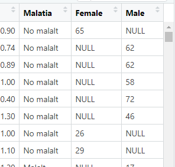

```{r setup, include=FALSE}
# Fixeu-vos amb l'error = T, això és per poder mostrar-vos els errors!
knitr::opts_chunk$set(echo = TRUE, error = T)
```

## Introducció

En aquesta classe repassarem els errors més comuns que tots fem en R i aprendrem a
identificar-los i solucionar-los.

## Carreguem dades

```{r}
liver <- read_csv("indian_liver_patient.csv")
```

No heu carregat la llibreria!

```{r}
library(readr)
liver <- read_csv("indian_liver_patient.csv")
```

No troba el fitxer? Fixeu-vos que és perquè està dins de la carpeta input:

```{r}
liver <- read_csv(input/indian_liver_patient.csv)
```

Ara ens hem deixat les cometes!

```{r}
liver <- read_csv("input/indian_liver_patient.csv")
```

Si no ens diu res és que tot correcte (en principi).

## Manipulació

En aquesta bbdd, la variable Dataset ens indica malaltia o no. Volem canviar el nom de la variable i codificar correctament l'estat:

Primer canviem el nom de la variable a "Malaltia"

```{r}
liver %>% rename(Malaltia = Dataset)
```

El paquet una altra vegada...

```{r}
library(dplyr)
liver %>% rename(Dataset = Malaltia)
```

Ho hem posat al revés! El nom nou va al principi:

```{r}
liver %>% rename(Dataset = Malaltia)
```

Ara ha funcionat, però per què m'ho està imprimint en pantalla?
Perquè no ho he fet apuntar una altra vegada a liver!

```{r}
liver <- liver %>% rename(Malaltia = Dataset)
```

Ara vull canviar els valors de Malaltia, posant 1 a "No malalt" i 2 a "Malalt".

```{r}
liver <- liver %>%
  mutate(Malaltia = case_when(
    Malaltia = 1, No malalt
    Malaltia = 2, Malalt
  )
  )
```

Ui quin drama. Si ens fixem, ens diu unexpected ",". Això vol dir que en la primera coma que veu, no hi hauria d'haver una coma. Si mirem els exemples (recordeu, ?case_when) el primer és:


Entre el condicional i el valor necessitem una titlla (~), no una coma!

```{r}
liver <- liver %>%
  mutate(Malaltia = case_when(
    Malaltia = 1 ~ No malalt
    Malaltia = 2 ~ Malalt
  )
  )
```

Ara no li agrada el parèntesi. Aquest és potser una mica més difícil de veure, però si mirem a l'exemple una altra vegada, veiem que, després de cada condició, hi ha una coma.

```{r}
liver <- liver %>%
  mutate(Malaltia = case_when(
    Malaltia = 1 ~ No malalt,
    Malaltia = 2 ~ Malalt,
  )
  )
```

Ara sembla que no hi agrada la coma primera una altra vegada. Tornem a mirar l'exemple; veiem que és perquè els valors són cadenes alfanumèriques, per tant han d'anar entre cometes!

```{r}
liver <- liver %>%
  mutate(Malaltia = case_when(
    Malaltia = 1 ~ "No malalt",
    Malaltia = 2 ~ "Malalt",
  )
  )
```

Estem avançant! Ara ens diu que hi ha un problema amb la primera condició (Malaltia = 1). Diu que espera un valor lògic però li hem donat un valor numèric (double vol dir numèric). Si ens hi fixem bé, veiem que Malaltia = 1 està creant un objecte que es diu Malaltia i que val 1 ja que només hem posat un =. Recordem que per mirar una condició necessitem dos iguals!

```{r}
liver <- liver %>%
  mutate(Malaltia = case_when(
    Malaltia == 1 ~ "No malalt",
    Malaltia == 2 ~ "Malalt",
  )
  )
```

Ara sí!


## Subseleccions

Ara volem agafar trossos de l'objecte. Això ho fem amb select i filter:

Imaginem que volem agafar només les dones (Female)

```{r}
liver %>% 
  filter(Gender = Female)
```

Fixeu-vos que aquí l'error ja ens diu que potser ens hem deixat un igual una altra vegada! Efectivament:

```{r}
liver %>% 
  filter(Gender == Female)
```

Object 'Female' not found; les cometes!!

```{r}
dones <- liver %>% 
  filter(Gender == "Female")
```

Ara sí!

Ara volem seleccionar les variables Age, Gender i Total_bilirubin:

```{r}
liver %>%
  select(Age, Gender, Total_Bilirubin)
```

Aquesta era fàcil.

Ara volem agafar tots els que siguin numèrics:

```{r}
liver %>%
  select(is.numeric)
```

Val, això sembla que potser ha funcionat, però ens dóna un Warning interessant. Això passa a vegades, la funció ens està dient que, tot i que va bé, hauríem de posar un filter. Intenteu fer aquests canvis perquè en un futur és possible que canviïn la funció i en lloc de donar un warning, doni un error.

Hem de fer:

```{r}
liver %>%
  select(where(is.numeric))
```

Un altre error típic en el seleccionar en una condició és fer: 

```{r}
liver %>%
  select(where(is.numeric()))
```

Quan fem aquests tipus de seleccions la funció de condició **no** porta parèntesis.

Filtres:

```{r}
liver %>%
  filter(Gender = Female)
```

Dos iguals, no un!

```{r}
liver %>%
  filter(Gender == Female)
```

Falten les cometes!

```{r}
liver %>%
  filter(Gender == "Female")
```

Ara sí.

```{r}
liver %>%
  filter(c(Gender == "Female", Albumin > 3))
```

Si tenim dues condicions, en aquest cas **no** hem de posar un vector, simplement anar-lies llistat:

```{r}
liver %>%
  filter(Gender == "Female", Albumin > 3)
```

## Pivotacions

Imagineu que, per alguna raó, ara vull posar les edats dels homes i les dones cadascun en una columna; ho puc fer amb pivot_wider:

```{r}
temp <- liver %>% select(-Malaltia) %>%
  tidyr::pivot_wider(names_from = Gender, values_from = Age)
```

Fixeu-vos que no em dóna un error, però em dóna un warning i em diu que les "Values no estan únicament identificades). En aquest cas, el que passa és que les persones o són homes o són dones, per tant, en els que no siguin, tindré missings:



Fixeu-vos que no té sentit el que he fet per l'estructura que té el dataframe. Aquest és un exemple tonto però aquest warning passarà sovint i **sempre** l'hem de tenir en compte perquè vol dir que no hem fet el pivotatge que volíem fer i l'hem de pensar millor. 

## Anàlisi estadístic

```{r}
t_student = t.test(liver$Gender)
```

D'una forma una mica rebuscada, però em diu que què faig fent un t-test d'una variable categòrica; només es poden fer de variables contínues!

```{r}
t_student = t.test(liver$Total_Bilirubin, liver$Gender)
```

Aquest és un clàssic de quan ens confonem entre entrar les dades a un test d'hipòtesi en dos vectors o en una fórmula. Jo puc entrar la bilirrubina d'homes i dones com a dos vectors en un test t, així:

```{r}
# vector amb els valors dels homes
homes <- liver %>% filter(Gender == "Male") %>% pull(Total_Bilirubin)
# vector amb els valors de les dones
dones <- liver %>% filter(Gender == "Female") %>% pull(Total_Bilirubin)
# t-test amb dos vectors:
t.test(dones, homes)
```

Però la manera més natural de fer-ho serà:

```{r}
t.test(liver$Total_Bilirubin ~ liver$Gender)
```

O més net encara:

```{r}
t.test(Total_Bilirubin ~ Gender, liver)
```

## Models

```{r}
model = lm(Malaltia~.)
```

Tal com ens diu l'error, ens hem deixat les dades!

```{r}
model = lm(Malaltia~., data=liver)
```

Ara ens diu que hi ha missings, infinits, que és tot un drama, vaja. Realment a vegades aquests errors no ens ajuden gaire, però ens està dient que estem posant una variable categòrica (Malaltia) com a variable dependent d'una regressió lineal, i per tant això no pot ser. Si volem una variable categòrica com a dependent, hem de fer una regressió logística:

```{r}
model = glm(Malaltia~., data=liver, family = "binomial")
```

Ja gairebé ho tenim això: y values han d'estar entre 0 i 1. Això vol dir que no troba la manera de categoritzar correctament la variable dependent, anem a mirar què passa:

```{r}
str(liver)
```

Veiem que les variables Gender i Malaltia estan codificades com a caràcter i per tant no sap què fer amb elles! No ens hem currat prou la formatació abans de l'anàlisi i ara ens està tornant per destrossar-nos la vida. En fi, ho fem:

```{r}
liver <- liver %>%
  mutate(across(where(is.character), as.factor))
```

I ara:

```{r}
model = glm(Malaltia~., data=liver, family = "binomial")
```

Fixeu-vos que ara ens treu un warning: aquest warning vol dir que ha trobat un model perfecte i que és capaç de separar completament les dues mostres (malalts i no malalts). Això normalment vol dir que ens hem equivocat i hem posat alguna variable que és igual que la variable predita (per exemple, l'hem recodificat però ens hem oblidat l'antiga). Anem a veure el resultat del model per saber què ha passat:

```{r}
summary(model)
```

Sembla que el model té força sentit i no hi ha cap variable que ho predigui tot, així que, a priori, no fem cas del warning. 

Models més avançats. Imagineu que volem fer servir la llibreria randomForests:

```{r}
forest = randomForest(Dataset~., data=liver)
```

L'hem de carregar primer (i assegureu-vos que l'heu instal·lat):

```{r}
# install.packages("randomForest")
library(randomForest) 
```

L'anem a utilitzar:

```{r}
forest = randomForest(Malaltia~., data=liver)
```

Ai ara a veure què passa; ho posem a l'[stackoverflow](https://stackoverflow.com/questions/41664317/randomforest-error-in-na-fail-default-missing-values-in-object):

Tinc missings! No he netejat bé!!

Investigo:

```{r}
summary(liver)
```

Doncs sí, sembla que la variable Albumin_and_Globulin_Ratio té 4 missings. Per ara els trec (podeu mirar com tractar-los en la [classe de missings ](https://github.com/ecorreig/analisi_dades_r/blob/main/sessio_extra_missings.Rmd)).

```{r}
liver <- liver %>% tidyr::drop_na()
```

A veure ara?

```{r}
forest = randomForest(Malaltia~., data=liver)
forest
```

Perfecte, tot bé!
